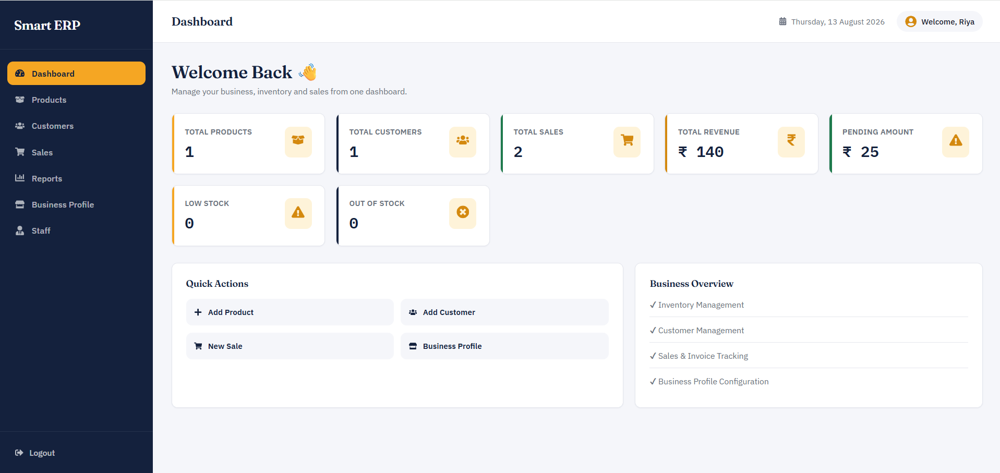

# Smart ERP — Multi-Tenant Inventory & Billing System

A full-stack, multi-tenant ERP (Enterprise Resource Planning) web application built for small shopkeepers to manage products, customers, sales, and billing — with role-based staff access, all under one shared business account.

Built with the **MERN stack** (MongoDB, Express, React, Node.js).

---

## Features

- **Multi-tenant architecture** — each shop's data is fully isolated by business, not by individual user
- **Role-based staff accounts** — shop owners (admin) can invite staff/manager accounts that share access to the same shop's data
- **Product & inventory management** — stock tracking, low-stock/out-of-stock alerts, active/archived products
- **Customer management** — full customer directory with purchase history
- **Sales & billing** — create sales with editable per-item pricing (supports discounts/bargained prices), automatic stock deduction, and atomic invoice numbering
- **Profit & discount tracking** — every sale records purchase cost, MRP, and actual sale price to calculate real profit margins and discounts given
- **Payment tracking** — mark pending payments as paid; dashboard separates collected revenue from pending receivables
- **PDF invoice generation** — branded, downloadable invoices for every sale
- **Reports dashboard** — sales, product, and customer reports with profit/discount breakdowns
- **JWT authentication** with secure password hashing (bcrypt)
- **Rate-limited login** to prevent brute-force attacks
- **Responsive UI** with a custom design system

---

## Tech Stack

**Frontend:** React (Vite), React Router, Axios, React Toastify, React Icons
**Backend:** Node.js, Express, MongoDB, Mongoose
**Auth:** JWT, bcrypt
**PDF Generation:** PDFKit
**Other:** express-rate-limit, dotenv

---

## Architecture Highlights

- **Business-scoped data model** — Products, Customers, Sales, and Counters are all scoped to a `businessId` rather than an individual `userId`, enabling true multi-user collaboration within a single shop (owner + staff share live data).
- **Atomic invoice numbering** — a per-business counter with a compound unique index (`business + invoiceNumber`) prevents invoice number collisions between different shops.
- **MongoDB transactions** used for sale creation to keep stock deduction, invoice numbering, and sale records consistent even under concurrent requests.
- **Price snapshotting** — every sale item stores the product's MRP and purchase cost _at the time of sale_, so historical profit/discount reports stay accurate even if product prices change later.

---

## Getting Started

### Prerequisites

- Node.js (v18+)
- A MongoDB database (local or [MongoDB Atlas](https://www.mongodb.com/atlas))

### Backend Setup

```bash
cd backend
npm install
cp .env.example .env
# Fill in your MONGO_URI and JWT_SECRET in .env
npm run dev
```

### Frontend Setup

```bash
cd frontend
npm install
npm run dev
```

The app will be available at `http://localhost:5173` (frontend) and `http://localhost:5000` (backend API).

---

## Environment Variables

Create a `backend/.env` file (see `.env.example`):

| Variable     | Description                                   |
| ------------ | --------------------------------------------- |
| `MONGO_URI`  | Your MongoDB connection string                |
| `PORT`       | Port for the backend server (default: 5000)   |
| `JWT_SECRET` | A long, random secret used to sign JWT tokens |

---

## Project Structure

```
ERP-System/
├── backend/
│   ├── controllers/     # Business logic for each resource
│   ├── models/           # Mongoose schemas
│   ├── routes/            # API route definitions
│   ├── middleware/     # Auth, business, and rate-limit middleware
│   └── server.js
└── frontend/
    └── src/
        ├── pages/         # Route-level pages
        ├── components/  # Reusable UI components
        ├── styles/        # CSS design system
        └── api/            # Axios instance
```

---

## Screenshots



---

## Future Improvements

- CSV/Excel export for reports
- Email invoices directly to customers
- Multi-currency support
- Dark mode

---

## License

This project is open source and available for learning purposes.
